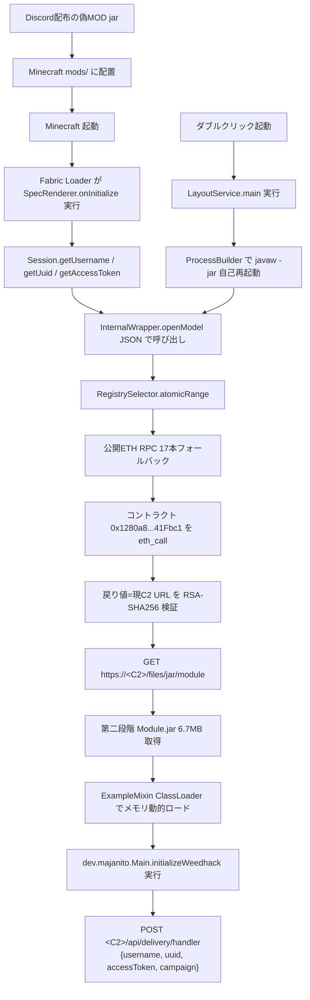

<div align="center">

# mc-fake-mod-stealer-analysis

### Discordで配布されている偽Minecraft MOD型アカウント窃取マルウェアの解析

[](#検体)
[](#攻撃フロー)
[](#検体)
[](LICENSE)

**Ethereumスマートコントラクトを C2 のレジストリに使う、ステルス重視の Minecraft アカウントスティーラーを 2026/04/08 に捕獲した記録。**

---

</div>

## 概要

2026年4月、Discord 経由で配布されていた **偽の Minecraft Fabric MOD** 2 検体を入手・解析した記録です。

| 検体 | 配布名 | サイズ | 検出名 |
|---|---|---|---|
| #1 | `MoneyDupeXLimit-1.2.jar` | 97 KB | `Trojan:Win32/Egairtigado!rfn` |
| #2 | `Comet-V1.21.jar` | 不明 | `Trojan:Win32/Egairtigado!rfn` |

両者は表向き「Hypixel SkyBlock のコイン複製ツール」「Cometクライアント」を装い、実際には Microsoft アカウントの **アクセストークン窃取** + 第二段階ペイロード実行を行います。

ロジック本体は以下の特徴を持ちます。

- C2 URL を **Ethereum スマートコントラクト** に格納し、公開 ETH RPC 17本のフォールバック経由で取得
- 取得した URL を**埋め込み RSA-2048 公開鍵 + SHA256 で署名検証**
- DNS over HTTPS と完全に検証無効化された TLS で C2 通信
- 第二段階 Java JAR を**メモリ上のみで動的ロード**（ファイルレス）
- スタンドアロン実行とFabric MODロードの**二刀流**で永続化

## 検体

### MoneyDupeXLimit-1.2.jar

| 項目 | 値 |
|---|---|
| 偽装作者 | `Ranqz` |
| 偽装説明 | `RANQZ` |
| Fabric mod id | `moneydupex` |
| Main-Class | `dev.impl.LayoutService` (スタンドアロン実行用) |
| Fabric Entrypoint | `dev.impl.SpecRenderer.onInitialize` |
| 依存 | `fabricloader>=0.16.5`, `java>=21` |
| 再パッケージ済リソース | `assets/ref_upper.dat` (72KB 暗号化) |

### Comet-V1.21.jar

Defenderが書き込み即時に検疫したため詳細未取得。`Trojan:Win32/Egairtigado!rfn` で同ファミリと判定済み。MS Defenderイベントログより：

```
2026/04/08 14:16:24  ID 1116  Trojan:Win32/Egairtigado!rfn 検出
2026/04/08 14:16:26  ID 1117  検疫成功 (CleaningActionID=3)
ユーザー: NT AUTHORITY\SYSTEM (リアルタイム保護)
```

## 攻撃フロー



## 主な技術的特徴

| カテゴリ | 仕掛け | 効果 |
|---|---|---|
| C2 配信 | Ethereum スマートコントラクト | テイクダウン不可、新URL一括配信 |
| C2 検証 | RSA-2048 + SHA256 | 第三者によるC2乗っ取り防止 |
| C2 RPC | 公開 ETH RPC エンドポイント 17 本 | 単一ノード遮断で死なない |
| 名前解決 | DNS over HTTPS (Cloudflare/Google/1.1.1.1) | OS DNS, hosts, ISP フィルタ回避 |
| TLS | 全証明書受理する `X509TrustManager` | 企業 TLS インスペクション回避 |
| HTTP | 生 SSLSocket + SNI 偽装 | URL ベースの IDS/IPS 回避 |
| 第二段階 | JarInputStream + 自作 ClassLoader でメモリ展開 | ディスクに痕跡残さない |
| 文字列保護 | XOR (key = 先頭 1 バイト) でhex 文字列に難読化 | 静的 strings 解析回避 |
| 偽装 | Fabric example mod のファイル名・パッケージ名そっくり | 解析者の理解を妨害 |
| 二刀流 | Main-Class + Fabric Entrypoint | スタンドアロン起動でも、MOD として読まれても実行 |

## 窃取される情報

確認済み（一段階目時点）：

- Minecraft username
- Minecraft UUID
- **Minecraft access token (JWT)** ← 即アカウント乗っ取り可能
- 実行環境タグ (`Fabric` / `DoubleClick`)
- キャンペーン ID (`17c1db77-cc87-4783-88d1-7ceca88d88c5`)

第二段階 (`dev.majanito.Main.initializeWeedhack`) 以降の実装は[第二段階解析](docs/second_stage.md)を参照。

## 関連ドキュメント

| ファイル | 内容 |
|---|---|
| [docs/IOCS.md](docs/IOCS.md) | 全 IoC（ハッシュ・URL・コントラクト・公開鍵） |
| [docs/technical_analysis.md](docs/technical_analysis.md) | 各クラスの詳細解析 |
| [docs/decoded_strings.md](docs/decoded_strings.md) | XOR 復号した全難読化文字列 |
| [docs/second_stage.md](docs/second_stage.md) | 第二段階 `Module.jar` の構成 |
| [docs/remediation.md](docs/remediation.md) | 感染した場合の対処手順 |
| [docs/timeline.md](docs/timeline.md) | 捕獲・解析の時系列メモ |

## 対処（感染した可能性がある場合）

1. **Minecraft / Microsoft アカウントのアクセストークンを失効**
   - https://account.live.com/proofs/Manage で「すべてのデバイスからサインアウト」
   - パスワード変更 + 二段階認証有効化
2. プロセスツリーから `javaw.exe` の親が `Minecraft.exe` 以外のものを停止
3. Defender でフルスキャン（既知シグネチャ：`Trojan:Win32/Egairtigado!rfn`）
4. ブラウザ・Discord・暗号通貨ウォレットの全セッション失効

詳細手順は [docs/remediation.md](docs/remediation.md)。

## ライセンス

MIT License — Copyright (c) 2026 cUDGk
詳細は [LICENSE](LICENSE) を参照。

> [!WARNING]
> このリポジトリは防御目的のセキュリティ研究のための情報共有です。
> 解析対象のサンプルそのものは含まれません（ハッシュのみ記録）。
> 記載されている C2 URL・コントラクトアドレス等を悪用しないでください。
